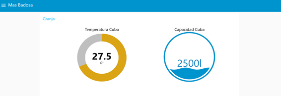

# ESPRESSIF
Este repositorio se ha creado explícitamente para el _postgrado de IoT_ de la _Fundación CIM-UPC_ con la premisa de representar al grupo **ESPRESSIF** como ingeniería en el proyecto _**CIMILK**_ para el cliente _Receive All Signals Perfectly_[`RASP`].

## [Documentación](/Documentación)
Hay toda la documentación enviada al cliente. Dicha información se ha enviado cada tres semanas para poder cumplir con todos los requerimientos del cliente. 
En conclusión, se ha utlitzado una metodologia _Agile_. Especificamente la metodologia _**SCRUM**_. 
Así que hemos estructurado la documentación por Sprints.

- ### [Sprint 01](/Documentaci%C3%B3n/Sprint%2001)

- ### [Sprint 02](/Documentaci%C3%B3n/Sprint%2002)

- ### [Sprint 03](/Documentaci%C3%B3n/Sprint%2003)

- ### [Sprint 04](/Documentaci%C3%B3n/Sprint%2004)

Además, se ha añadido una carpeta con fotos de como quedará el dashboard para este proyecto.
- ### [Imagenes](/Documentaci%C3%B3n/Imagenes)

[[Go to top]](#ESPRESSIF)

## [Prototipo](/Prototipo)
Hay toda la programación utilizada y explicada para poder enseñar al cliente un prototipo del futuro funcionamiento según nuestra propuesta. Es solo un prototipo ya que se han utilizado dispositivos y sensórica simple, para el proyecto final se utilizará el material descrito en la documentación. 

El prototipo que se ha creado es una representación reducida de toda la comunicación del proyecto. Des de el sensor o dispositivo en la granja hasta el dashboard en la nube.

En la siguiente imagen se pueden apreciar los sensores, dispositivos y comunicaciones entre ellos que se usan para poder llevar a cabo la adquisición de datos y cumplir los requisitos establecidos por el cliente. 

Como se puede visualizar en el esquema, se tienen tres ESP32 con diversos sensores según el dato que se quiera controlar. La comunicación de estos dispositivos se va a encargar de diferentes áreas, tales como el control de la puerta de la fabrica, la cuba de las granjas, las vacas y el camión, donde a continuación se explicará cada una de ellas para entender el prototipo que se llevara a cabo.
La adquisición de datos de las vacas se determinará por medio de ESP32, la cual tendrá dos sensores conectados a la mismas, tales como el sensor de temperatura, y GPS. Es importante destacar que la transmisión de datos se va a llevar a cabo a través de LoraWan ya que se utilizara un GatewayLora. 
Por otra parte, en el esquema se puede determinar que la cuba se controlara a su vez a través de la tarjeta la cual tendrá conectada un sensor de temperatura y en este caso para simular el nivel de tanque se conectara el sensor de ultrasonido para así poder simular la capacidad que contiene el mismo. La comunicación se llevará a cabo a través del protocolo MQTT.
Los camiones estarán controlados a través de una ESP32, la cual tiene conectado un sensor de temperatura, sensor de ultrasonido para determinar el nivel en el que se encuentra el tanque al cargarse del producto o descargase y un GPS para su localización.
La puerta de la fábrica se contrala a través de una ESP32, tendrá conectado un relé, el cual recibirá la orden de apertura por el usuario a través de telegram. Todo esto se realizará con el protocolo de comunicación MQTT. 
Los datos correspondientes a la cubas, camiones y puerta se transmitirán a un mismo Gateway como se puede apreciar en el esquema anteriormente
La comunicación de las ESP32 a la raspberry la cual hace de Gateweay y también de Wifi,  mediante el protocolo de MQTT transmitirá los datos a la nube Azure, donde se tendra un broker y Node-red para así poder tener la información en el dashboard para los usuarios.

En el apartado de las granjas en el Dashboard, a través de la programación en el sensor de temperatura DHT11 y el sensor de ultrasonido logramos representar datos ficticios de la cuba en el dashboard, los cuales se aprecian de la siguiente manera. 

La puerta se contralará a través de un Bot de Telegram con el nombre Espressifcim_bot. Actualmente, tiene dos comandos, el de “/abrir” y “/cerrar”. Para la representación de la puerta en el prototipo se utiliza un Led, ya que su estado simboliza la apertura de la puerta.

A continuación, la visualización del Bot: 

- ### [Arduino](/Prototipo/Arduino)

- ### [Azure](/Prototipo/Azure)

- ### [Nodered](/Prototipo/Nodered)

- ### [Raspberry](/Prototipo/Raspberry)

[[Go to top]](#ESPRESSIF)

## Autores
- [@Ferrancf5](https://github.com/Ferrancf5)
- [@AdrianaSalame20](https://github.com/AdrianaSalame20)
